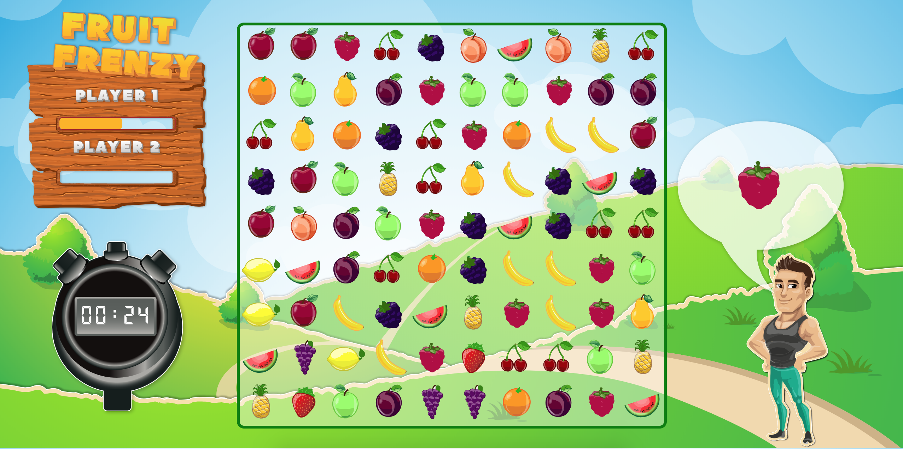

#FRUIT FRENZY

##Game Instructions:

######The objective of the game is to work co-operatively with player 2. You must both collect enough points to advance to the next game by capturing as many of the fruit called by the instructor within 60 seconds. If you both successfully collect the fruit within the alloted time, then you will advance to the next game. If anyone fails, then it is GAME OVER and you must start again...

1. When the page loads a modal pop up initiates the game starting by displaying "Ready, Set, Go!"
2. Once "Go!", a timer of 60 seconds starts. At this moment a fruit is thought up by the instructor in the speechbubble above the instructor.
3. You must navigate the board and click on every fruit that he is asking for.
4. When you collect the correct fruit, you will be awarded + 3pts!
5. But! Be careful, for any incorrectly selected fruit, you will have -3pts deducted.
6. You must collect 99pts before or at the time of the timer ending.
7. Otherwise it is game over and you are unable to proceed to the next level with your partner.
8. If player one succesfully achieves the score.
9. Then it will be player two's go, if they successfully complete the challenge then you shall both advance in the next level.You can only advance with both players completing the task.
10. If any player loses, then you must start the game again.

##Technologies Used
* HTML 5
* CSS 3
* JavaScript
* Jquery
* Google Fonts
* GitHub
* Git
* HTML Audio
* Animation
* Adobe Illustrator

##Approach Taken
Initially the game was meant to have the same functionality as the popular game 'Candy Crush'.

However, it evolved in to a reactions game. Partly due to the complexity required to build 'Candy Crush' being too hard for my first game but also due to the fact that I thought a co-operative reactions game would be more socially engaging and fun.

Once I established the concept for the game, I decided on a narrative.

Because the demographic of users would be for a younger audience I thought that the game should reinforce positive imagery. Hence why I decided on a fruit inspired game.

With the concept and narrative sorted. I began collating imagery to then alter in Adobe Illustrator to give it continuity. These were all used to make high fidelity mock-ups.

Once these were made I drafted a simple HTML file. Adding all the elements that were in my mockups.

After completing this, I started adding all the imagery in my Adobe Illustrator files, converted them to .svg and added them to my site. Then inspecting the element online, I would make all the CSS changes. Once I was happy with them, I would copy and paste the CSS alterations made in the web browser and add them in to my CSS file.

Once the majority of the CSS was completed I started to work on the psuedo code for my Javascript. I realised quickly, that I should not be generating the grid within HTML. I should randomly generate a 2-Dimensional array with Jquery and assign classes to the numbers in the array and then append this in to an empty div in my HTML. 

Once the board was randomly generating fruit to be selected. I randomly generated a fruit in the speechbubble.

The most challenging part was making a conditional function to operate when the fruit being called in the speechbubble by the instructor was the same as the element clicked in the 2-D array. When these match I wanted to increase a progress bar and also remove that selected fruit, shift the cells above 1 index down and randomly generate a new element at the top of the column. 

I did this by using a for loop that brought the functions down, however I found that this caused too many bugs. I realised that I was using the incorrect methods. I was using .addClass() and .removeClass() but realised that this wasn't the correct way to do it as it was keeping the classes.

link to my website-
https://willgriff95.github.io/Fruit-Frenzy/

##Future Features
